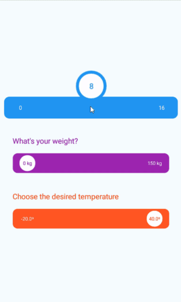

# React Native Motion Slider

A JavaScript slider component for React Native (iOS and Android).  
React Native Motion Slider is a high-quality slider with a stunning UI / UX.



## Installation

```bash
npm install react-native-motion-slider --save
```   


## Usage

```javascript
import MotionSlider from 'react-native-motion-slider';
```

```javascript
<View>
    <MotionSlider
    	title={'Choose the desired temperature'} 
        min={-20} 
        max={40}
        value={25.8} 
        decimalPlaces={1}
        units={'º'}
        backgroundColor={['rgb(3, 169, 244)', 'rgb(255, 152, 0)', 'rgb(255, 87, 34)']}
        onValueChanged={(value) => console.log(value)}
        onPressIn={() => console.log('Pressed in')}
        onPressOut={() => console.log('Pressed out')}
        onDrag={() => console.log('Dragging')}
    />
</View>
```

## API
### Properties

| **Property**          | **Description**                                                  | **Type** |
|-----------------------|------------------------------------------------------------------|----------|
| width                 | Slider width.                                                    | number   | 
| height                | Slider height.                                                   | number   |
| borderRadius          | Slider border radius. | number |
| backgroundColor       | String array containing the slider colors. By default it has only one element. | [string] |
| decimalPlaces         | Decimal places to display on min, max and value elements. | number |
| title                 | Slider title. | string |
| titleColor            | Slider title color. | string |
| titleStyle            | Slider title custom style. | StyleSheet |
| min                   | Minimum value of the slider. | number |
| max                   | Maximum value of the slider. | number |
| value                 | Current slider value. | number |
| units                 | Value units (e.g. 'km'). | string |
| minColor              | Color of min text element. | string |
| maxColor              | Color of max text element. | string |
| valueColor            | Color of value text element. | string |
| valueBackgroundColor  | Color of value container's background color. By default this color inherits the slider's background color. | string |
| fontSize              | Font size for min, max and value text elements. | number |
| fontWeight            | Font weight for min, max and value text elements. | string |
| fontFamily            | Font family for min, max and value text elements. | string | 

### Function Properties

| **Property**          | **Input**    | Notes                                                     |
|-----------------------|--------------|-----------------------------------------------------------|
| onValueChanged        | Slider value | Use this to update catch slider value on parent component |
| onPressIn             |              |                                                           |
| onPressOut            |              |                                                           |
| onDrag                |              |                                                           |

## Acknowledgement

*  [Virgil Pana](https://dribbble.com/shots/3868232-ios-Fluid-Slider-ui-ux), who designed the concept and inspired me to create this component. I recommend checking his works.  
  
## License

MIT.  
